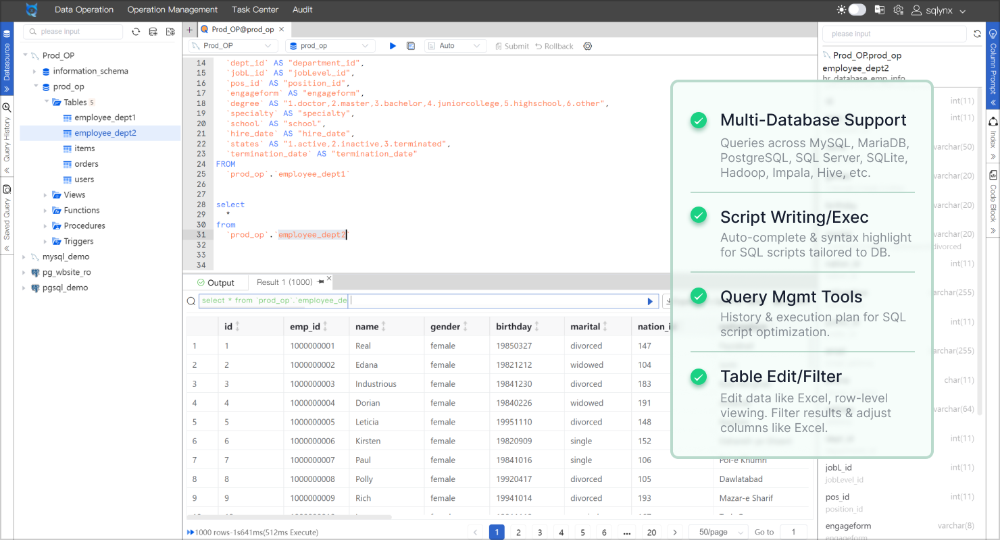
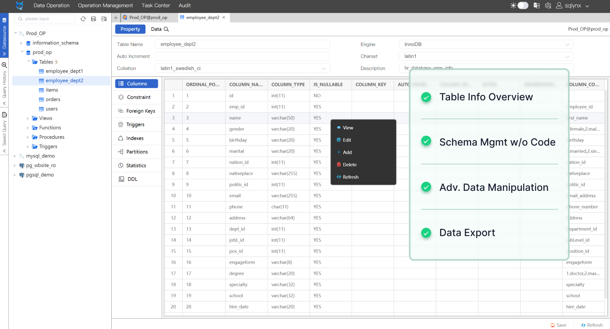
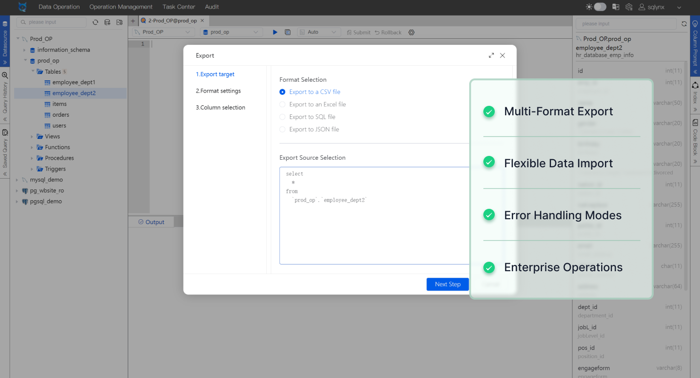
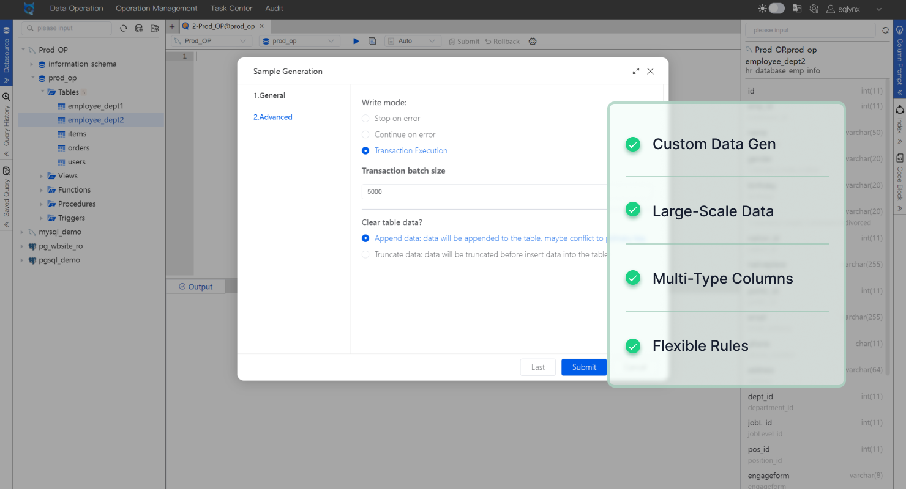

<h1 align="center">
  <br>
  <a href="https://www.sqlynx.com"></a>
  <br>
  SQLynx Pro
  <br>
</h1>

<h4 align="center">Desktop And Web SQL Tool. Both web and desktop access. Support popular SQL databases like mysql, mariadb, postgresql, sqlite and more. </h4>

<p align="center">
  <a href="https://badge.fury.io/js/electron-markdownify">
    
  </a>
  <a href="https://jdk.java.net/java-se-ri/8-MR6">
    
  </a>
  <a href="https://saythanks.io/to/bullredeyes@gmail.com">
      
  </a>
  <a href="https://www.paypal.me/AmitMerchant">
    
  </a>
</p>

<p align="center">
  <a href="#key-features">Key Features</a> •
  <a href="#how-to-use">How To Use</a> •
  <a href="#download">Download</a> •
  <a href="#license">License</a>
</p>






## Key Features
* SQL Query
* Tables Management
* Data Export & Import
* Sample Data Generation

## How To Use

To clone and run this application, you'll need [Git](https://git-scm.com) and [JDK 1.8+](https://jdk.java.net/java-se-ri/8-MR6) installed on your computer. From your command line:

```bash
# Clone this repository
$ git clone https://github.com/ChHsiching/SQLynx.git

# Go into the repository
$ cd SQLynx

# [Optional] Change files owner and group
$ chown [OWNER][:GROUP] *

# Assign executable permissions to all shell scripts
$ chmod 755 *.sh

# View the commands provided by the app
$ ./sqlynx-ide.sh

# You will see:
# *************************************************
# **                                             **
# **         sqlynx-ide  commands                **
# **                                             **
# *************************************************
# **       sh  sqlynx-ide.sh start               **
# **       sh  sqlynx-ide.sh stop                **
# **       sh  sqlynx-ide.sh restart             **
# *************************************************

# Run the app
$ sudo sh sqlynx-ide.sh start
```

> **Note**
> If you're using Windows operating system or want to read official documentation, see [the Installation Guide](https://www.sqlynx.com/content/document/en_version/SQLynx_installation%20documentation_v3.0.0.pdf).

## Download

You can [download](https://www.sqlynx.com/download/) the latest installable version of SQLynx for Windows, macOS and Linux.