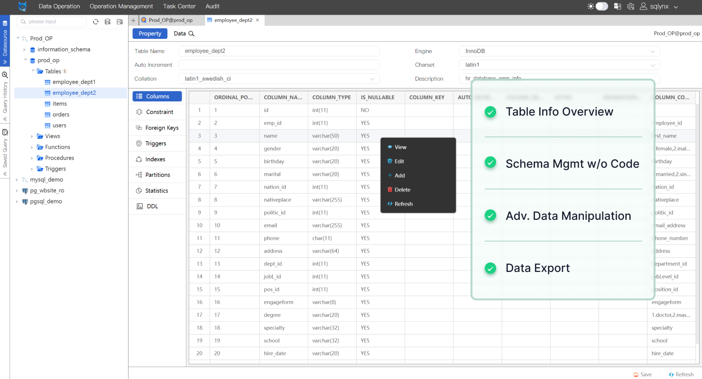
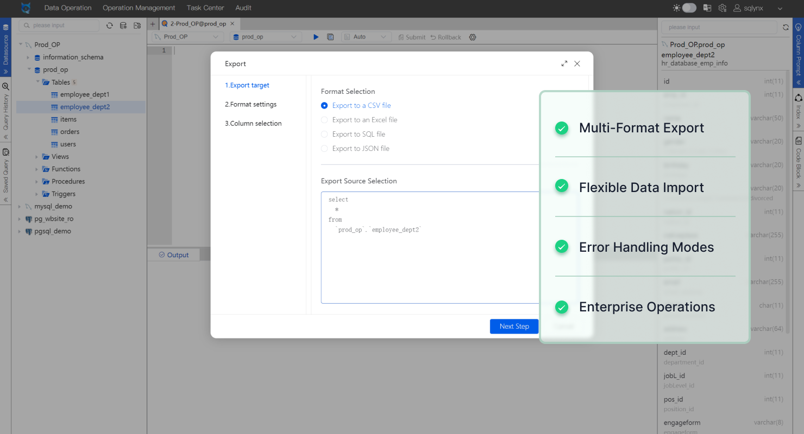

<h1 align="center">
  <br>
  <a href="https://www.sqlynx.com"></a>
  <br>
  SQLynx Pro
  <br>
</h1>

<h3 align="center">Desktop And Web SQL Tool. Both web and desktop access. Support popular SQL databases like mysql, mariadb, postgresql, sqlite and more. </h3>

<p align="center">
  <a href="https://www.sqlynx.com/product/">
    
  <a href="https://jdk.java.net/java-se-ri/8-MR6">
    
  </a>
  <a href="mailto:hsichingchang@gmail.com">
      
  </a>
  <a href="https://github.com/ChHsiching/SQLynx">
    
  </a>
</p>

<p align="center">
  <a href="#key-features">Key Features</a> •
  <a href="#how-to-use">How To Use</a> •
  <a href="#download">Download</a> •
  <a href="#license">License</a>
</p>

> **Attention**
> This release provides installation and setup scripts for SQLynx, a sophisticated SQL query optimization and analysis tool developed by [SQLynx Inc.](https://www.sqlynx.com). The original SQLynx software is provided by SQLynx Inc., and is not modified in this repository. These scripts simplify the environment configuration and installation process for SQLynx.






## Key Features
- SQL Query
- Tables Management
- Data Export & Import
- Sample Data Generation

## How To Use

To clone and run this application, you'll need [Git](https://git-scm.com) and [JDK 1.8+](https://jdk.java.net/java-se-ri/8-MR6) installed on your computer. From your command line:

### Manual Execution

To manually set up and run the application, follow these steps:

```bash
# Clone the Repository:
$ git clone https://github.com/ChHsiching/SQLynx.git

# Navigate to the Repository:
$ cd SQLynx

# [Optional] Change File Ownership:
# Replace `[OWNER]` with your user and `[GROUP]` with your group if necessary.
$ chown [OWNER][:GROUP] *

# Assign Executable Permissions:
$ find . -type f -name "*.sh" -exec chmod 755 {} +

# View Available Commands:
$ ./sqlynx-ide.sh

# You will see:
# *************************************************
# **                                             **
# **         sqlynx-ide  commands                **
# **                                             **
# *************************************************
# **       sh  sqlynx-ide.sh start               **
# **       sh  sqlynx-ide.sh stop                **
# **       sh  sqlynx-ide.sh restart             **
# *************************************************

# Run the app:
$ sudo sh sqlynx-ide.sh start

# Stop the app:
$ sudo sh sqlynx-ide.sh stop
```

### Automated Deployment

For automated deployment, use the provided `deploy.sh` script. This script will handle the setup and configuration automatically.

```bash
# Clone the repository
$ git clone https://github.com/ChHsiching/SQLynx.git
   
# Navigate to the repository
$ cd SQLynx

# Assign Executable Permissions:
find . -type f -name "*.sh" -exec chmod 755 {} +

# Run the deployment script
$ ./deploy.sh
```
The `deploy.sh` script will:
- Copy necessary files to the installation directory.
- Set up executable permissions for all shell scripts.
- Register the application with the system (e.g., create symlinks, install desktop entries).

**Post-Deployment**:
After running the `deploy.sh` script, you can start and stop the application using the `sqlynx` command:

```bash
# Start the app
$ sqlynx start

# Restart the app
$ sqlynx restart

# Stop the app
$ sqlynx stop

# check the version
$ sqlynx version

# view the usage information
$ sqlynx help
```

> **Note**
> If you're using Windows operating system or want to read official documentation, see [the Installation Guide](https://www.sqlynx.com/content/document/en_version/SQLynx_installation%20documentation_v3.0.0.pdf).

## Disclaimer

This repository provides scripts and configuration files to assist with the deployment of SQLynx. These scripts are provided "as-is" without any warranty or guarantee. For official support and licensing details, please contact SQLynx Inc.

## Download

You can [download](https://www.sqlynx.com/download/) the latest installable version of SQLynx for Windows, macOS and Linux.

## Contributing

If you have improvements or suggestions for these deployment scripts, please open an issue or submit a pull request.

For contribution guidelines, please refer to the [CONTRIBUTING.md](CONTRIBUTING.md) file.

## License

The SQLynx source code is owned by SQLynx Inc. and is provided without any explicit license in this repository. Please refer to the [original source](https://www.sqlynx.com/product/) for licensing details.

The deployment scripts and configuration files in this repository are provided under the [MIT License](LICENSE), unless otherwise noted.

For more details, please refer to SQLynx's [official website](https://www.sqlynx.com) or contact SQLynx Inc. for licensing inquiries.

---

> GitHub [@ChHsiching](https://github.com/ChHsiching) &nbsp;&middot;&nbsp;
> Email [@Hsichingchang](mailto:hsichingchang@gmail.com)